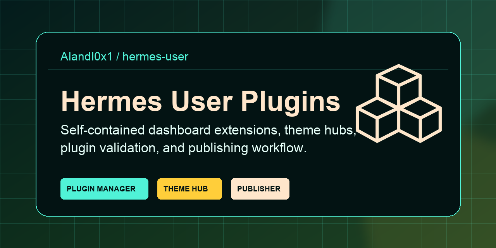
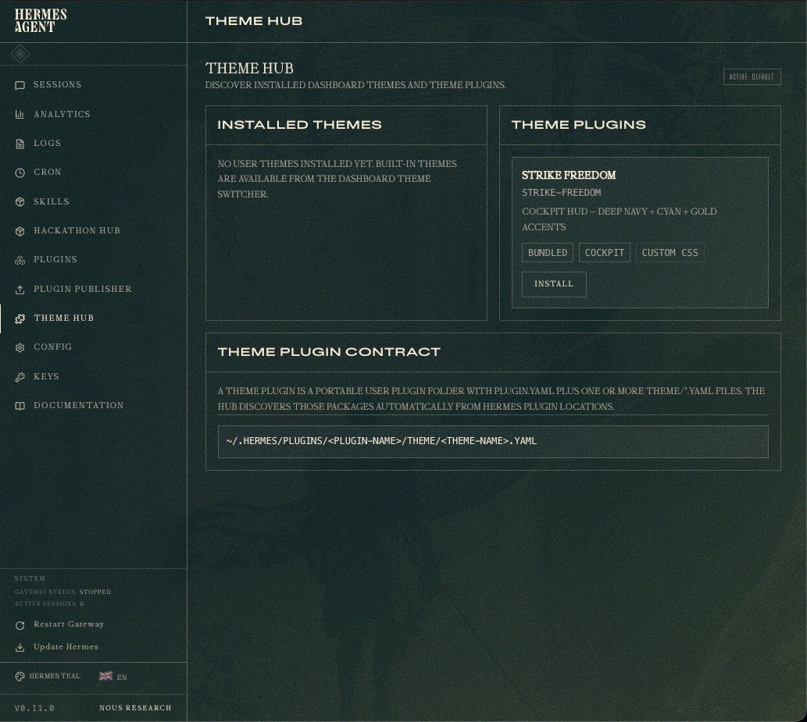
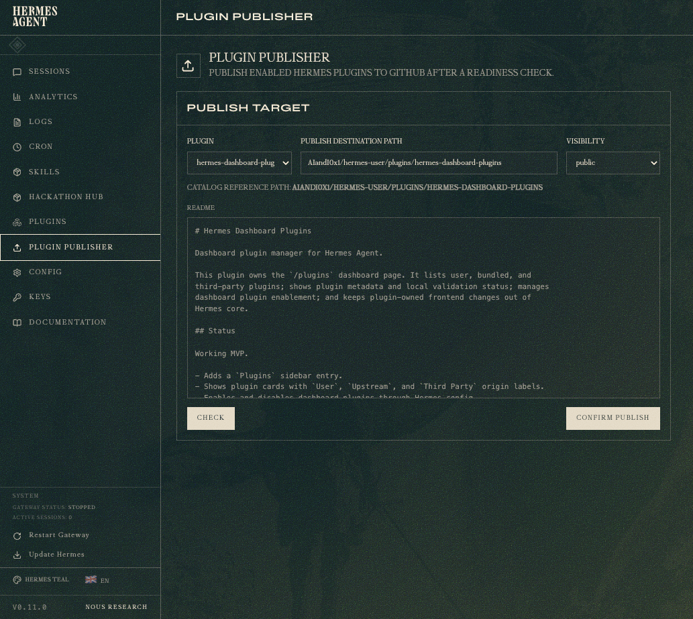

# Hermes User Plugins

Portable userland plugin collection and validation standard for Hermes Agent.

This repository contains self-contained Hermes Agent dashboard extensions,
tools, skills, docs, examples, and publishing workflows. It is intentionally
separate from upstream `hermes-agent`: plugins here are user-owned packages that
can be installed into the local Hermes user plugin folder without modifying
Hermes core.



## What This Is

- A user plugin collection for Hermes Agent.
- A dashboard plugin manager and catalog.
- A hackathon submission assistant for Discord review workflows.
- A theme hub for discovering and activating dashboard themes.
- A plugin publisher that audits packages before GitHub publication.
- A small plugin contract with examples, validation scripts, and CI.

## What This Is Not

- It is not a fork of Hermes Agent core.
- It is not an official Hermes plugin registry.
- It does not claim Hermes team certification or signing.
- It does not expose local dashboard routes to the public internet.

## Quick Install

Install the whole collection, then copy the plugin you want into the active
Hermes user plugin folder:

```bash
git clone https://github.com/AIandI0x1/hermes-user.git /tmp/hermes-user
mkdir -p ~/.hermes/plugins
cp -R /tmp/hermes-user/plugins/<plugin-name> ~/.hermes/plugins/<plugin-name>
hermes dashboard --no-open
export HERMES_DASHBOARD_URL="${HERMES_DASHBOARD_URL:-http://127.0.0.1:9119}"
curl "$HERMES_DASHBOARD_URL/api/dashboard/plugins/rescan"
```

For profile-based Hermes installs, use the active profile's Hermes home:

```text
<HERMES_HOME>/plugins/<plugin-name>
```

## Plugins

| Plugin | Status | Purpose |
| --- | --- | --- |
| [`hermes-dashboard-plugins`](plugins/hermes-dashboard-plugins) | Published | Adds the `/plugins` catalog page, origin labels, validation state, and enable controls. |
| [`hermes-hackathon-hub`](plugins/hermes-hackathon-hub) | Published | Builds Discord-ready Hermes plugin submissions with readiness checks and honest trust language. |
| [`hermes-theme-hub`](plugins/hermes-theme-hub) | Published | Discovers installed and plugin-provided dashboard themes, then installs or activates them. |
| [`plugin-publisher`](plugins/plugin-publisher) | Published | Audits plugin folders and prepares explicit GitHub publishing commands. |

## Screenshots

| Plugins Catalog | Hackathon Hub |
| --- | --- |
|  |  |

| Theme Hub | Plugin Publisher |
| --- | --- |
|  |  |

## Validate

Run the repository-level plugin validator before publishing or submitting:

```bash
python scripts/validate_plugin.py \
  plugins/hermes-dashboard-plugins \
  plugins/hermes-hackathon-hub \
  plugins/hermes-theme-hub \
  plugins/plugin-publisher
```

CI runs the same validation workflow on GitHub Actions.

## Local Dashboard URLs

Dashboard links such as `http://127.0.0.1:9119/plugins`,
`http://127.0.0.1:9119/theme-hub`, and
`http://127.0.0.1:9119/hackathon-hub` are local loopback URLs. They are only
reachable from the machine running `hermes dashboard` and are not public
support, contact, webhook, or remote access endpoints.

Docs and generated install commands use `HERMES_DASHBOARD_URL` for the local
dashboard origin. Leave it unset for the default `http://127.0.0.1:9119`, or set
it when running Hermes dashboard on another local port.

## Trust Model

Local validation is useful, but it is not official Hermes certification.

This repository uses conservative trust language:

- `local`: package exists on disk and can be inspected.
- `locally_validated`: local checks passed.
- `unsigned`: no official signature is available.
- `official_verification_unavailable`: Hermes official verification is not yet
  available for this package.

Do not claim a plugin is certified, signed, or endorsed by the Hermes team
unless that claim can be verified against an official Hermes trust root.

## Repository Layout

```text
hermes-user/
  PLUGIN_CONTRACT.md
  CONTRIBUTING.md
  SECURITY.md
  docs/
  examples/
  plugins/
    hermes-dashboard-plugins/
    hermes-hackathon-hub/
    hermes-theme-hub/
    plugin-publisher/
  scripts/
    validate_plugin.py
```

Each plugin owns its frontend, docs, tools, skills, tests, and metadata inside
its own plugin folder. User plugin behavior should not require direct edits to
upstream Hermes Agent core files.

## Plugin Contract

Start here when creating or reviewing a plugin:

- [Plugin contract](PLUGIN_CONTRACT.md)
- [Plugin lifecycle](docs/PLUGIN_LIFECYCLE.md)
- [Minimal dashboard plugin example](examples/minimal-dashboard-plugin)
- [Tool-only plugin example](examples/tool-only-plugin)
- [Skill-only plugin example](examples/skill-only-plugin)

## Publishing Destination

The canonical destination format for plugins in this repository is:

```text
AIandI0x1/hermes-user/plugins/<plugin-name>
```

Before publishing, run the plugin publisher readiness plan and review the secret
scan, destination path, repo visibility, screenshots, and generated GitHub
commands.

## Contributing

Contributions should keep plugin-owned functionality inside the plugin folder
that owns it. See [CONTRIBUTING.md](CONTRIBUTING.md) and
[SECURITY.md](SECURITY.md) before opening issues or publishing plugin packages.
