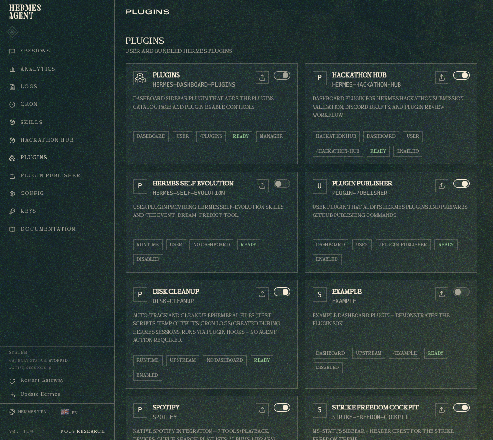

# Hermes Dashboard Plugins

Dashboard plugin manager for Hermes Agent.

This plugin owns the `/plugins` dashboard page. It lists user, bundled, and
third-party plugins; shows plugin metadata and local validation status; manages
dashboard plugin enablement; and keeps plugin-owned frontend changes out of
Hermes core.

## Status

Working MVP.



- Adds a `Plugins` sidebar entry.
- Shows plugin cards with `User`, `Upstream`, and `Third Party` origin labels.
- Enables and disables dashboard plugins through Hermes config.
- Keeps itself enabled so plugins can be re-enabled.
- Provides a frontend ownership rule and checker.
- Uses a plugin-owned icon and plugin-owned frontend assets.

## Install

```bash
mkdir -p ~/.hermes/plugins
git clone <repo-url> ~/.hermes/plugins/hermes-dashboard-plugins
hermes dashboard --no-open
```

Open the dashboard and select **Plugins** from the sidebar:

```text
http://127.0.0.1:9119/plugins
```

If direct loading lands on `/sessions`, open `/plugins` from the sidebar after
the dashboard plugin loader has initialized.

## Features

- Plugin catalog for the active Hermes user plugin folder and bundled plugin
  folder.
- Origin classification:
  - `Upstream`: bundled with the Hermes Agent checkout.
  - `User`: installed in the active Hermes user plugin folder.
  - `Third Party`: installed locally and marked as external/community.
- Enable and disable controls for dashboard plugins.
- Local validation for dashboard manifest, entry bundle, CSS, and backend API
  file paths.
- Trust display that distinguishes local validation from future official Hermes
  certification.
- Frontend ownership rule that checks plugin UI changes remain inside the
  plugin that owns them.

## Verify Locally

```bash
python -m pytest tests/test_plugin_api.py tests/test_frontend_ownership_rule.py -q
node --check dashboard/dist/index.js
python -m py_compile dashboard/plugin_api.py scripts/enforce_frontend_ownership.py
python scripts/enforce_frontend_ownership.py
```

Expected public-readiness state:

```text
secret scan: clear
README: present
LICENSE: present
dashboard manifest: valid
frontend ownership rule: passing
```

## Project Layout

```text
hermes-dashboard-plugins/
├── README.md
├── LICENSE
├── plugin.yaml
├── dashboard/
│   ├── manifest.json
│   ├── plugin_api.py
│   ├── assets/
│   │   └── plugin-cubes.svg
│   └── dist/
│       ├── index.js
│       └── style.css
├── rules/
│   ├── README.md
│   └── frontend-ownership.md
├── scripts/
│   └── enforce_frontend_ownership.py
└── tests/
    ├── test_frontend_ownership_rule.py
    └── test_plugin_api.py
```

## Boundaries

- Do not hardcode plugin-specific dashboard behavior into Hermes core.
- Store each plugin's frontend assets and dashboard changes inside that
  plugin's folder.
- Do not claim official Hermes certification unless an official registry and
  signing key are available.
- Do not publish local caches, credentials, or generated runtime state.

## Frontend Ownership Rule

The rule lives in:

```text
rules/frontend-ownership.md
scripts/enforce_frontend_ownership.py
```

It enforces the project rule that plugin-owned dashboard changes stay inside the
plugin folder that owns the feature.
