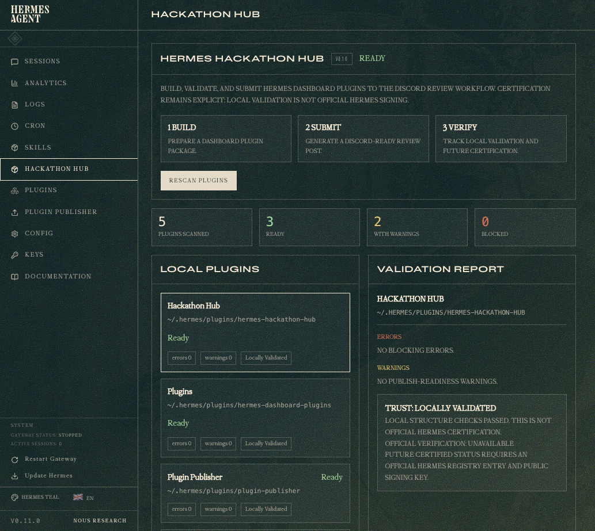

# Hermes Hackathon Hub

Hermes Hackathon Hub powers a **Plugins** section inside the Hermes dashboard.
It is a plugin for browsing, validating, and submitting Hermes plugins, inside
Hermes.

Hermes exposes dashboard plugin APIs and plugin-created tabs, but there is no
built-in dashboard plugin manager yet. Hackathon Hub starts as that missing
section: it appears as **Plugins** in the dashboard, lists cards from the
Hermes Agent plugin locations, validates local dashboard plugins, prepares GitHub/screenshot
packages, generates Discord-ready review posts, and keeps certification claims
honest. After the event, the same surface is designed to grow into a
Discord-centered community plugin review hub.

It follows the collection-level [Hermes User Plugin Contract](https://github.com/AIandI0x1/hermes-user/blob/main/PLUGIN_CONTRACT.md).

## Status

Working MVP. The dashboard tab, local plugin card catalog, details view, local
validation API, and certification-readiness panel are implemented.



## Goal

Give Hermes plugin creators one place in the dashboard to:

- see discovered dashboard plugins
- validate local dashboard plugin packages
- inspect plugin metadata and local validation state
- track review and certification status
- verify Hermes team signatures once an official trust root exists

## Hackathon Positioning

The meta angle is intentional: this is a Hermes dashboard plugin that helps
people create and submit Hermes dashboard plugins. It is useful immediately for
the hackathon, and it points toward a post-hackathon plugin ecosystem without
pretending to be official infrastructure before review.

One-line pitch:

```text
A plugin for building and submitting Hermes plugins, inside Hermes.
```

Submission pitch:

```text
Hermes Hackathon Hub helps creators validate local Hermes dashboard plugins,
prepare a complete GitHub + screenshot submission, generate a Discord-ready
review post, and track the path toward community review and future Hermes
certification.
```

## Planned MVP

The first build focuses on the plugin catalog:

1. Scan Hermes Agent dashboard plugin locations.
2. Validate `manifest.json`, `dist/index.js`, optional CSS, and optional
   backend API files.
3. Show dashboard plugin cards.
4. Open plugin details when a card is clicked.
5. Show certification status as `Unsigned`, `Locally Validated`, or
   `Official Verification Unavailable`.

The MVP does not auto-post to Discord. It opens the channel and lets the user
send the generated post manually.

## Install

```bash
mkdir -p ~/.hermes/plugins
git clone <repo-url> ~/.hermes/plugins/hermes-hackathon-hub
hermes dashboard --no-open
curl http://127.0.0.1:9119/api/dashboard/plugins/rescan
```

For local development, edit the installed user plugin directly:

```bash
cd ~/.hermes/plugins/hermes-hackathon-hub
hermes dashboard --no-open
```

Open the dashboard:

```text
http://127.0.0.1:9119
```

This is a local-only loopback URL. It is reachable only from the machine
running `hermes dashboard`; it is not a public support, contact, or remote
access endpoint.

Then open the navigation sidebar and select **Plugins**. The active dashboard
route should become `/plugins`.

## Features

- Dashboard **Plugins** section powered by Hackathon Hub.
- Local dashboard plugin scanner across user and bundled Hermes Agent plugin locations.
- Card catalog for discovered dashboard plugins.
- Package validation for manifest, entry bundle, CSS, and API files.
- Unsafe declared paths are rejected if they escape `dashboard/`.
- Publish-readiness warnings for README, license, and screenshots.
- Clickable plugin details.
- Trust status panel that distinguishes local validation from official signing.

## Verify Locally

```bash
python -m pytest tests/test_plugin_api.py -q
node --check dashboard/dist/index.js
python -m py_compile dashboard/plugin_api.py
curl http://127.0.0.1:9119/api/plugins/hermes-hackathon-hub/scan
```

Expected validation status for this repository:

```text
ok: true
errors: []
warnings: []
trust.status: locally_validated
trust.official_verification: unavailable
```

## Project Layout

```text
hermes-hackathon-hub/
├── README.md
├── LICENSE
├── docs/
│   ├── CREATION_PLAN.md
│   ├── DISCORD_REVIEW_PROTOCOL.md
│   ├── GITHUB.md
│   ├── IMPLEMENTATION_PLAN.md
│   ├── PRODUCT_SPEC.md
│   ├── ROADMAP.md
│   ├── TODO.md
│   └── WORKFLOW.md
├── screenshots/
│   └── hackathon-hub-dashboard.png
├── tests/
│   └── manual-test-checklist.md
└── dashboard/
    ├── manifest.json
    ├── plugin_api.py
    └── dist/
        ├── index.js
        └── style.css
```

## Hermes Dashboard Plugin Shape

The eventual plugin should install as:

```text
~/.hermes/plugins/hermes-hackathon-hub/
└── dashboard/
    ├── manifest.json
    ├── plugin_api.py
    └── dist/
        ├── index.js
        └── style.css
```

Dashboard plugins are loaded by `hermes dashboard` from
`~/.hermes/plugins/<name>/dashboard/manifest.json`.

## Important Boundaries

- Do not require Discord login or Discord credentials for v1.
- Do not auto-submit messages to Discord.
- Do not claim official Hermes certification unless a public Hermes registry
  and signing key are available.
- Keep all validation local and explain what each status means.
- Make generated submission text easy to copy and manually post.

## Discord Submission Channel

Hackathon submission channel:

https://discord.com/channels/1053877538025386074/1497492452452470875

## Submission Framing

Recommended wording:

```text
Built as a hackathon entry, designed to grow into a Discord-centered community
plugin review hub after the event.
```

Avoid claiming this is the official plugin hub unless it is accepted or adopted
by the Hermes team.

## Workflow Docs

- [Project workflow](docs/WORKFLOW.md)
- [Roadmap](docs/ROADMAP.md)
- [TODO](docs/TODO.md)
- [GitHub publishing](docs/GITHUB.md)
- [Discord review protocol](docs/DISCORD_REVIEW_PROTOCOL.md)
